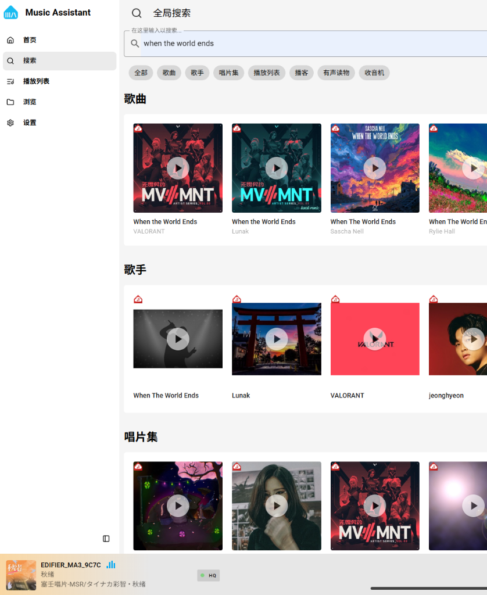
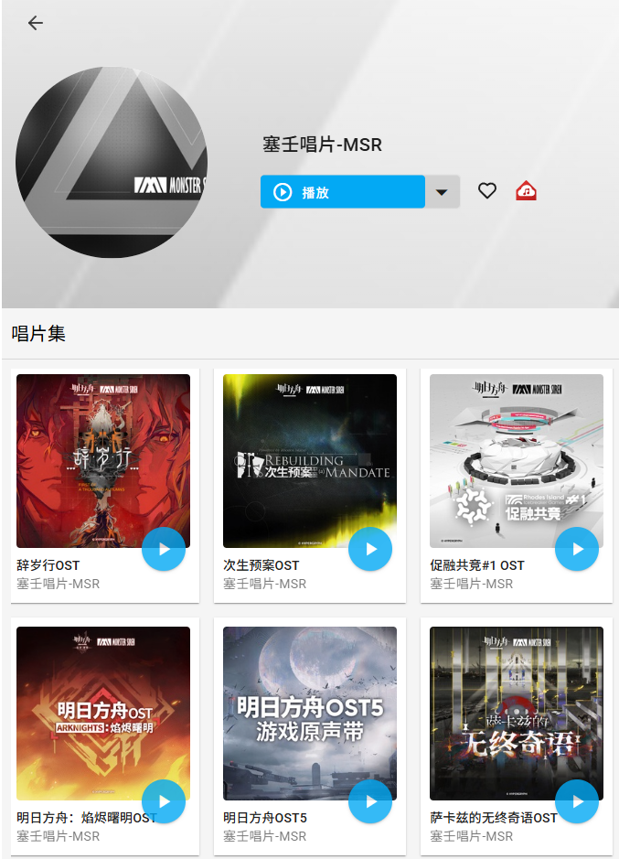
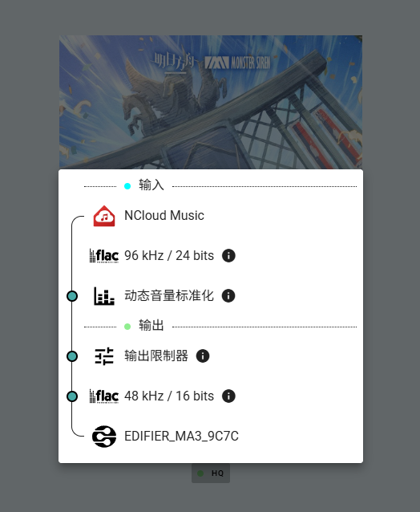
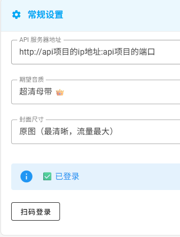
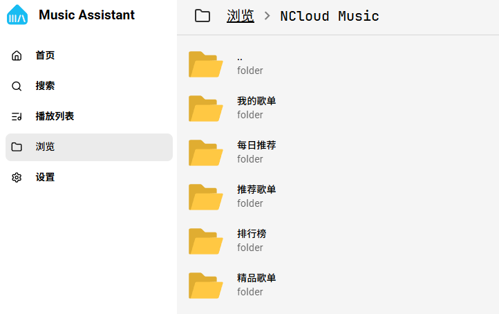
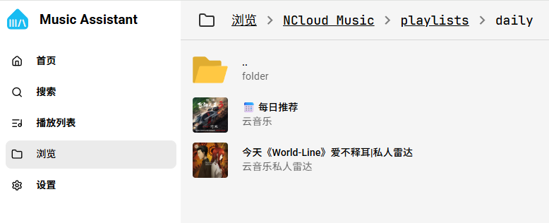
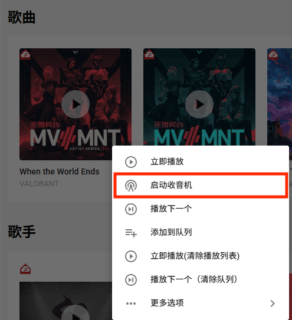
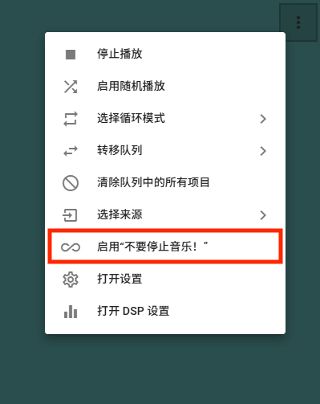
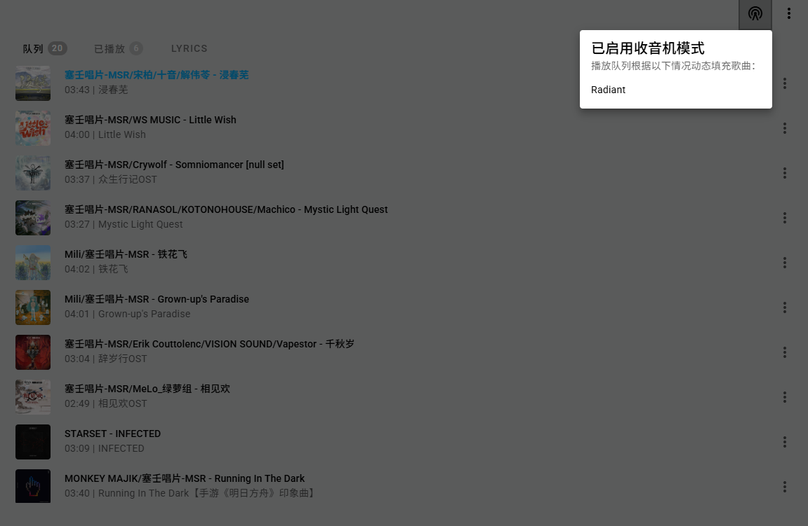

# MA NCloud Music


**MA NCloud Music** 是为 **[Music Assistant](https://github.com/music-assistant/hass-music-assistant)** 编写的云音乐第三方 Provider 插件。通过 `NeteaseCloudMusicApi-Enhanced` 接口提供支持，允许在您的智能家居系统中播放云音乐的曲库内容。

---

## 核心功能

- **内容搜索**：支持单曲、专辑、歌手、歌单的多维度搜索。
- **信息同步**：自动同步并展示当前账户内创建与收藏的歌单数据。
- **分类浏览**：提供层级化的目录结构，支持浏览以下版块：
  - `我的歌单` / `每日推荐` / `推荐歌单` / `排行榜` / `精品歌单`
- **音质选择**：允许发送特定的音质请求（实际生效音质受账号权益限制）。
- **封面解析**：支持设定全局封面的网络加载分辨率。
- **播放控制**：附带音源回退与重试等辅助机制。
- **收音机模式**：对接 MA 的收音机特性，基于相似歌曲和歌单自动补充播放列表。

---

## 界面预览

<div align="center">
  <table style="border: none; text-align: center;">
    <tr>
      <td><b>全局搜索与呈现</b></td>
    </tr>
    <tr>
      <td></td>
    </tr>
  </table>
  
  <br>

  <table style="border: none; text-align: center;">
    <tr>
      <td width="50%"><b>歌手详情页</b></td>
      <td width="50%"><b>歌曲文件详情</b></td>
    </tr>
    <tr>
      <td></td>
      <td></td>
    </tr>
  </table>
  
  <br>
  
  <table style="border: none; text-align: center;">
    <tr>
      <td><b>插件配置界面</b></td>
    </tr>
    <tr>
      <td></td>
    </tr>
  </table>
</div>
<p align="center"><i>* 界面排版可能会由于 Music Assistant 客户端版本及主题不同而存在差异。</i></p>

---

## 部署与安装

### 1. 前置依赖
- 运行中的 [Music Assistant](https://github.com/music-assistant/hass-music-assistant) (2.x 稳定版本)
- 已部署并可访问的 `NeteaseCloudMusicApi-Enhanced` 服务端点

### 2. 挂载安装 (以 Docker 为例)
需将下载得到的 `ncloud_music` 源代码目录直接挂载至 Music Assistant 容器中的 `providers` 环境路径。

> **注意**：下方代码片段针对 `python3.13` 环境。若您的主机镜像使用的 Python 版本不同，请替换路径中的 `python3.13` 为确切版本号。

```yaml
# docker-compose.yml
services:
  music-assistant:
    image: ghcr.io/music-assistant/server
    volumes:
      # 右侧路径必须指向容器内实际的 site-packages 路径
      - ./ncloud_music:/app/venv/lib/python3.13/site-packages/music_assistant/providers/ncloud_music
```
完成挂载并重启 Music Assistant 容器服务后，进入 `Settings -> Providers`，点击右下角的 **Add Provider**，从可用列表中选择 **NCloud Music** 进行添加。

---

## 配置指南

在 MA 的设置页面内选中 NCloud Music 后，按照以下各项进行输入：

1. **API 服务器地址**：填入外部架设好的 `NeteaseCloudMusicApi-Enhanced` 服务入口地址（如 `http://192.168.1.100:3000`）。
2. **账号授权登录**：
   - 点击界面提示中的 **扫码登录**。
   - 使用手机端云音乐 App 扫描产生的二维码并授权。
   - 切换回配置界面，点击右上角**「保存」**按钮，使当前授权完成的状态固化到存储内。
3. **期望音质**：在下拉框选项中评估并设定播放能达到的最高音量文件等级。
4. **封面尺寸**：建议保持或选择 `800` 级别（加载原图时网络环境可能会受上游 CDN 调控而拖慢速度）。

---

## 使用说明

### 1. 本地化资源浏览
应用 Music Assistant 自身层级特性，实现对远程结构库的对齐。
通过左侧导航栏的 **`浏览 > NCloud Music`** 菜单，可访问个人订阅与官方分发列表（含每日推荐、排行榜）。

<div align="center">
  <table style="border: none; text-align: center;">
    <tr>
      <td width="50%"><b>分层目录树</b></td>
      <td width="50%"><b>每日推荐与歌单</b></td>
    </tr>
    <tr>
      <td></td>
      <td></td>
    </tr>
  </table>
</div>

### 2. 收音机模式
对接内建 **收音机 (Radiant)** 指令系统，用于在现有歌单播放完毕后自动从底层推荐库中捞取新歌曲。

- **开启方法 1**：点击歌曲或歌单的展示项，并在右键辅助菜单内点击 **`启动收音机`**，系统将以此曲/单为种子，生成衍生的无限收音机队列。
- **开启方法 2**：在播放页面右上角辅助菜单内点击 **`不要停止音乐！`**，则在当前播放列表耗尽后，系统会自动向内填充后续推荐曲目。

<div align="center">
  <table style="border: none; text-align: center;">
    <tr>
      <td width="50%"><b>启用收音机入口 (Radio)</b></td>
      <td width="50%"><b>不要停止音乐入口 (DSTM)</b></td>
    </tr>
    <tr>
      <td></td>
      <td></td>
    </tr>
  </table>
  
  <br>

  <table style="border: none; text-align: center;">
    <tr>
      <td width="60%"><b>收音机生效提示</b></td>
    </tr>
    <tr>
      <td></td>
    </tr>
  </table>
- **触发表现**：启用后，底层机制将根据队列原有的音频特征指纹进行下发填充。

---

## 许可协议

本项目代码基于 [MIT License](LICENSE) 约束并开源。欢迎提交 Issue 与 Pull Request 建议。
